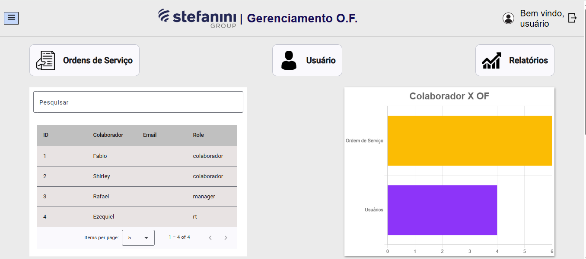
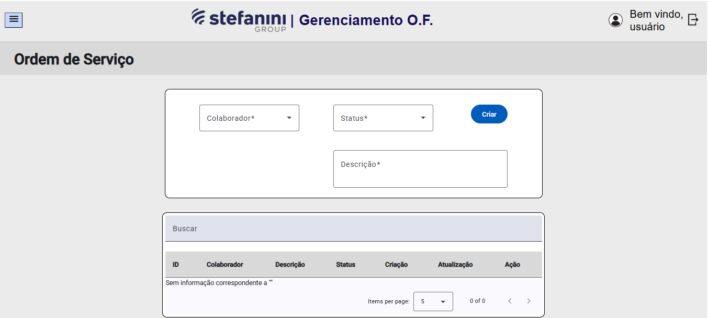
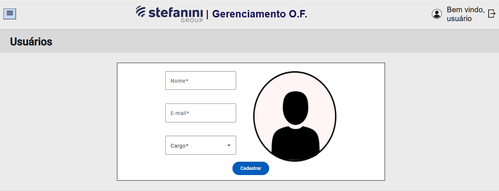
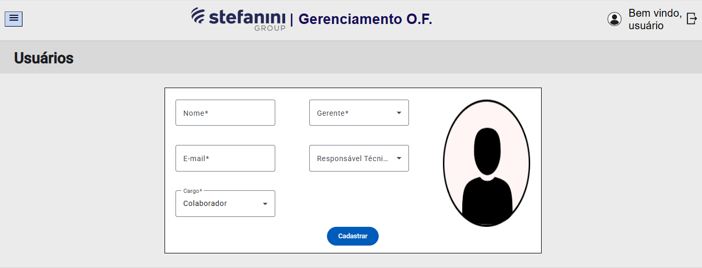

# Controle de Ordens de Fornecimento dos Colaboradores


### Tópicos
- [Descrição](#descrição)
- [Requisitos](#requisitos)
- [Como executar o projeto](#como-executar-o-projeto)
- [Acesso](#acesso)

## Descrição
Com o intuito de tirar a necessidade do uso de planilhas para o controle das ordens de fornecimento, viemos com este projeto com o objetivo de
automatizar essa função.

Para isso, temos a tela home onde fica algumas informações gerais a respeito dos colaboradores e ordens de fornecimento.



Logo abaixo, começamos a separar cada página a sua determinada área, então aqui você será capaz de criar, consultar, editar e excluir suas OFs.



Aqui você consegue criar os usuários, sendo que ao definir um colaborador, automaticamente é solicitado o gerente e responsável técnico relacionandos.





## Requisitos
- Node 23 ou acima
- Angular CLI 19 ou acima
- [Backend](https://github.com/Estagiarios-SPTech/controle-ordens-fornecimento-backend)
- Editor de código de preferência (Recomendável VSCode)

## Como executar o projeto
Antes de tudo, execute o comando abaixo para instalar as dependências necessárias:

```bash
npm install
```

Depois, para iniciar o servidor, execute:

```bash
npm start
```
Ou

```bash
ng serve
```

## Acesso
Quando o servidor estiver em execução, abra o seu navegador e digite `http://localhost:4200/`
